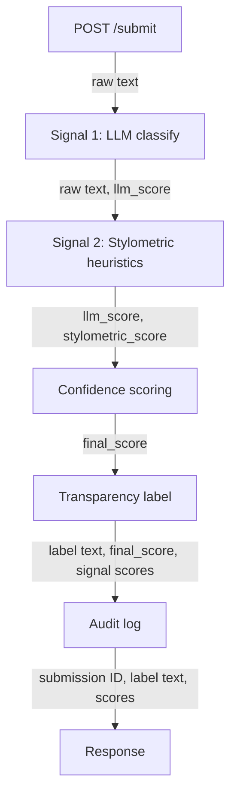
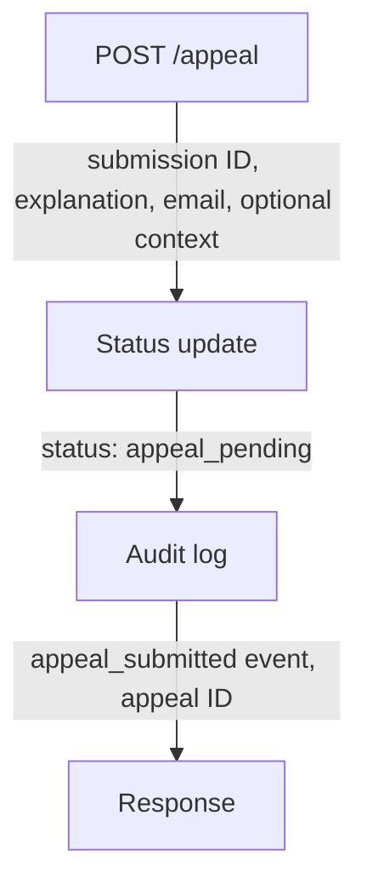

# Planning.md

## Human AI text classification

## Detection Signals

**LLM-based classification (Groq)**: ask the model to assess whether text reads as human or AI-generated. Returns a score (0-1) representing likely human (0) or likely AI (1). 

**Stylometric heuristics**: measure sentence length variance, type-token ratio (vocabulary diversity), and punctuation density
Each metric returns a score (0-1) representing likely human (0) or likely AI (1). 

Final score (0-1) is calculated into single confidence score with weights w1 and w2: 
final_score = w1 * llm_score + w2 * stylometric_score 

## Uncertainty representation

| Label | Score Range |
|---|---|
| Likely Human| <0.4 |
| Uncertain/Mixed | >=0.4 and <=0.6 |
| Likely AI | >0.6 |

## Transparency label design

**Likely AI**: text label shown for high confidence AI result

**Likely Human**: text label shown for high confidence human result

**Mixed/Uncertain**: text label shown for low confidence result

## Appeals workflow

**Who can submit**: The original submitter of a classified text. Appeals are tied to a specific submission ID. Each submission may have at most one open appeal at a time; resubmission after a reviewer decision requires a new classification run on revised text.

**What they provide**:
- Submission ID (required; pre-filled when opened from the result screen)
- Short written explanation of why they believe the label is wrong (required, max ~500 characters)
- Optional supporting context: links to earlier drafts, revision history notes, or a brief description of how the text was produced (e.g., “outline written by me, then expanded in Word”)
- Contact email (required) for reviewer follow-up

**What the system does on receipt**:
- Validates the submission exists, belongs to the session/user, and is eligible for appeal (no duplicate open appeal)
- Sets submission status from `classified` → `appeal_pending`
- Creates an appeal record with: appeal ID, submission ID, timestamp, user explanation, optional context, original label, original `final_score`, and per-signal breakdown (`llm_score`, stylometric sub-scores)
- Appends an audit log entry: `appeal_submitted` with appeal ID, submission ID, prior label/score, and client metadata (IP hash, user agent) for abuse tracing
- Returns confirmation to the submitter with appeal ID and expected review window; the UI shows “Under review” instead of the original transparency label

**What a human reviewer sees in the appeal queue**:
- Sortable list of `appeal_pending` items, newest first, with: appeal ID, submission date, appeal date, original label, `final_score`, and a one-line excerpt of the submitted text
- Detail view per appeal: full submitted text, original classification breakdown (LLM score, stylometric metrics and which heuristics drove the score), submitter explanation and optional context, submission metadata (word count, paste vs. typed indicator if captured)
- Reviewer actions: **Uphold** (keep original label), **Overturn to Likely Human**, **Overturn to Likely AI** or **Overturn to Mixed/Uncertain** — each requires a short internal note (not shown to submitter)
- On decision: status → `appeal_resolved`; original label updated if overturned; audit log records `appeal_resolved` with reviewer ID, decision, note, and timestamp; submitter notified by email with outcome and revised label (if changed)

## Anticipated edge cases

1. **Poetry with heavy repetition** — Refrains, anaphora, and fixed rhyme schemes drive type-token ratio down and sentence length variance toward zero. Stylometric heuristics may score this as uniformly “AI-polished” even when the poem is entirely human-written.

2. **Very short submissions (under ~150 words)** — There are too few sentences to measure length variance reliably, and TTR is unstable on small samples. The system will often land in **Mixed/Uncertain** or flip between **Likely Human** and **Likely AI** on minor edits.

3. **Human text that was heavily edited for clarity** — A rough personal draft run through Grammarly, a writing center, or peer review can gain uniform sentence rhythm and expanded vocabulary diversity in ways that mimic LLM smoothing, pushing an originally human piece toward **Likely AI**.

## Architecture

### Submission flow

### Appeal flow

## AI Tool Plan

### M3 — Submission endpoint + first signal

**Spec sections provided to the AI tool**
- **Detection Signals** — full description of both signals; implement only the first (LLM-based classification via Groq) in this milestone
- **Architecture → Submission flow** — diagram showing text entry → classification → result

**Ask the AI tool to generate**
- Flask app skeleton: project layout, `requirements.txt` alignment, env loading for `GROQ_API_KEY`, basic error handling
- `POST /submit` endpoint that accepts text, persists a submission record, and returns a placeholder result shape
- First signal function: `llm_classify(text) -> float` (0 = likely human, 1 = likely AI) using Groq per the Detection Signals spec

**Verification**
- Call `llm_classify()` directly in a short script or REPL with 3–4 hand-picked inputs (e.g., casual personal paragraph, obvious ChatGPT essay, one-line stub) before wiring it into `/submit`
- Confirm scores are in `[0, 1]` and directionally sensible
- Hit `/submit` with the same inputs and confirm the endpoint returns the raw `llm_score` without errors

### M4 — Second signal + confidence scoring

**Spec sections provided to the AI tool**
- **Detection Signals** — stylometric heuristics (sentence length variance, type-token ratio, punctuation density) and the weighted `final_score` formula (`w1 * llm_score + w2 * stylometric_score`)
- **Uncertainty representation** — score-to-label thresholds
- **Architecture → Submission flow** — diagram for where scoring fits in the pipeline

**Ask the AI tool to generate**
- Second signal function: `stylometric_score(text) -> float` aggregating the three heuristics into a single 0–1 score
- Scoring module: combine `llm_score` and `stylometric_score` with configurable weights `w1`/`w2`; map `final_score` to a preliminary label using the Uncertainty representation table
- Wire both signals into `/submit` so the response includes `llm_score`, `stylometric_score`, `final_score`, and `label`

**Verification**
- Run the same clearly human and clearly AI sample texts from M3 through the full scoring path
- Check that `final_score` and labels differ meaningfully between the two extremes (human samples &lt; 0.4, AI samples &gt; 0.6 ideally, or at least separated by &gt; 0.2)
- Confirm uncertain samples (short, ambiguous, or mixed-style text) land in the 0.4–0.6 band rather than always defaulting to one extreme

### M5 — Production layer

**Spec sections provided to the AI tool**
- **Transparency label design** — the three label variants and when each is shown
- **Appeals workflow** — eligibility, required fields, status transitions, audit logging
- **Architecture → Appeal flow** — diagram from appeal submission through reviewer resolution

**Ask the AI tool to generate**
- Label generation logic: map `final_score` to display strings (**Likely Human**, **Mixed/Uncertain**, **Likely AI**) per Transparency label design; expose label in `/submit` response and any result UI
- `POST /appeal` endpoint: validate submission ID and eligibility, accept explanation + email (+ optional context), set status `classified` → `appeal_pending`, create appeal record, write `appeal_submitted` audit log entry
- Rate limiting and input validation (Flask-Limiter, field length caps) on public endpoints

**Verification**
- Craft or reuse three test submissions whose scores fall in each band (&lt; 0.4, 0.4–0.6, &gt; 0.6) and confirm all three label variants are reachable from `/submit`
- Submit an appeal against a **Likely AI** or **Mixed/Uncertain** result; confirm status updates to `appeal_pending`, appeal record is created with score breakdown, and audit log contains `appeal_submitted`
- Confirm appeal is rejected for ineligible cases (duplicate open appeal, missing required fields)